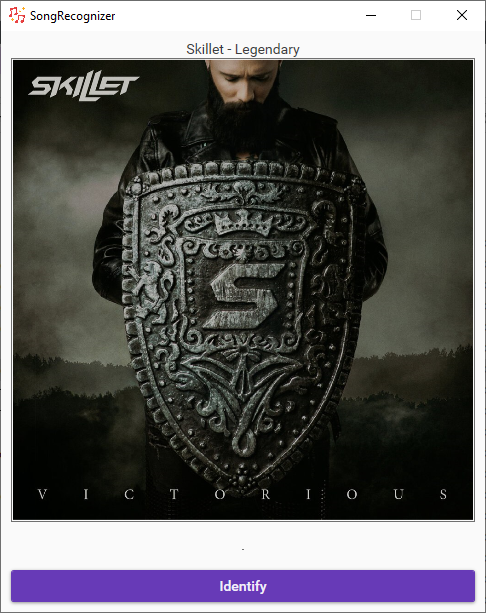

## SongRecognizer

This simple app allows to identify song currently playing on your computer.
It's totally free.

It uses Telegram bot *YaMelodyBot* from Yandex to recognize song.
So you should authenticate via telegram phone number.

#### Install Requirements
* Windows 10
* [.NET Core 3.1](https://dotnet.microsoft.com/download/dotnet-core/)
* [Microsoft Visual C++](https://aka.ms/vs/16/release/vc_redist.x64.exe)

#### Used Libs
* [TdLib](https://github.com/egramtel/tdsharp) - telegram API client
* [NAudio](https://github.com/naudio/NAudio) - recording song
* [MaterialDesignThemes](https://github.com/MaterialDesignInXAML/MaterialDesignInXamlToolkit) - UI styles
* [NLog](https://github.com/NLog/NLog) - logging
